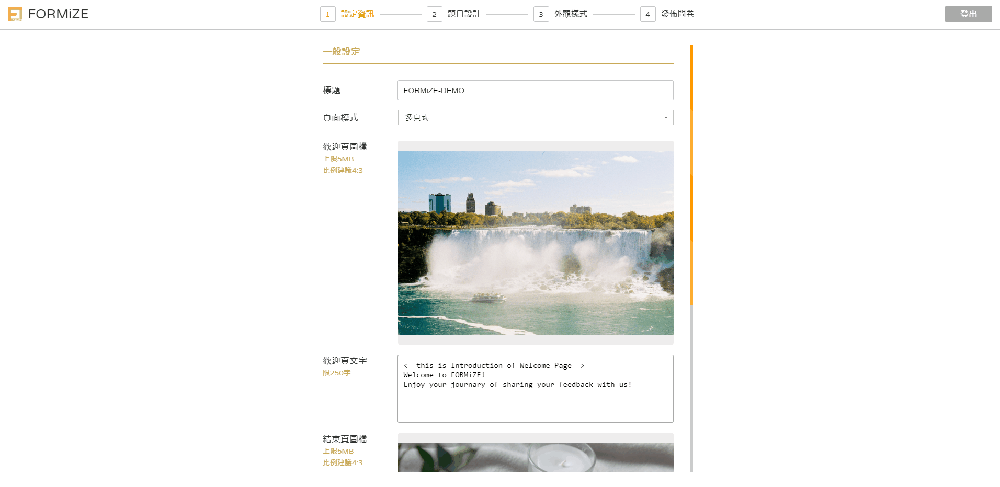
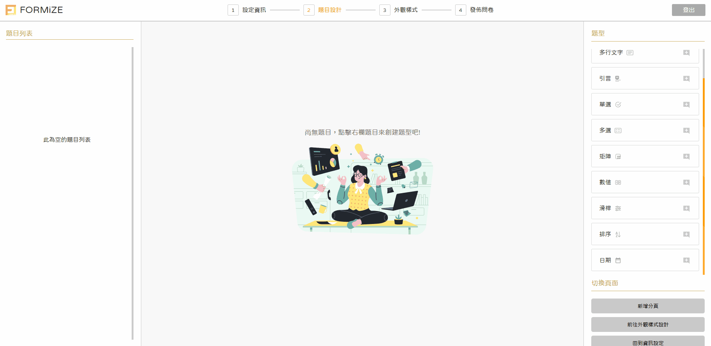
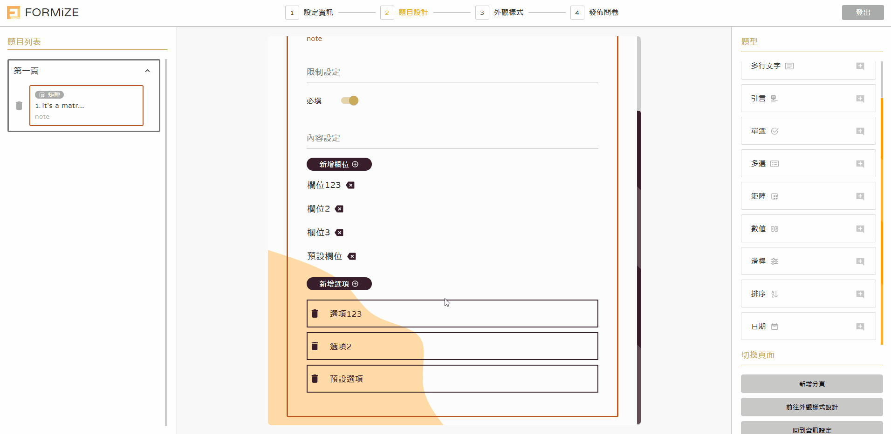
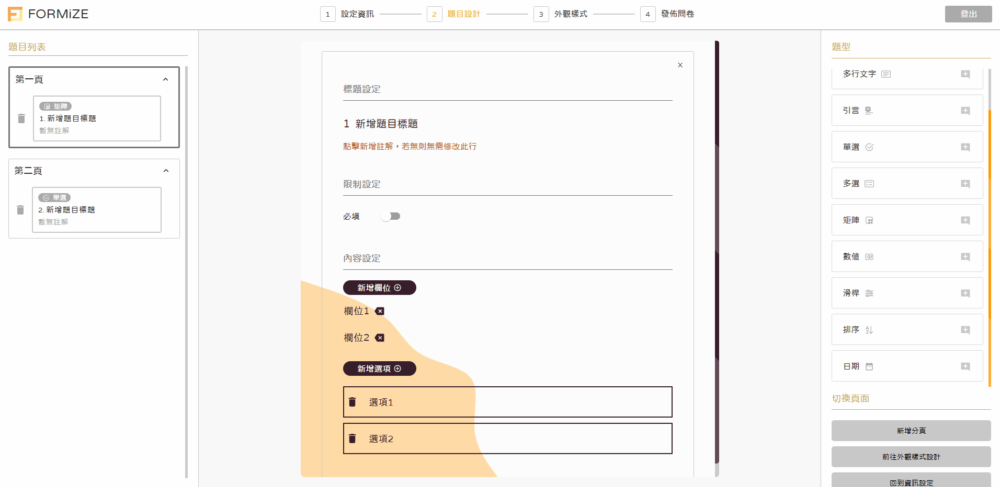
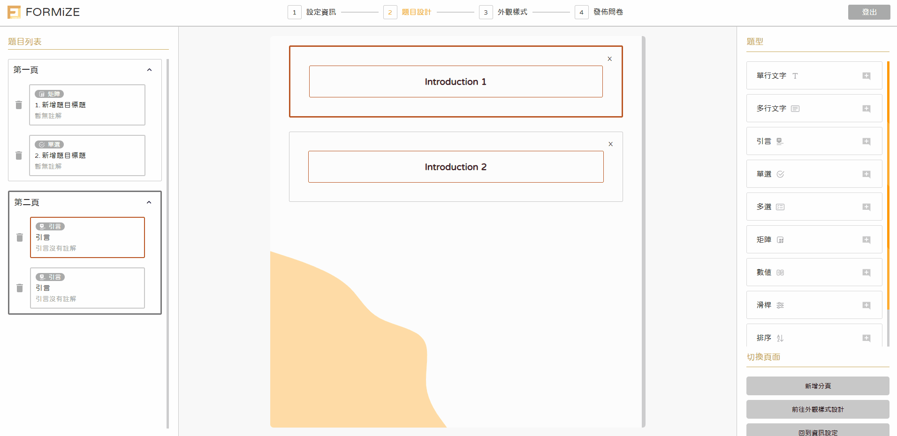
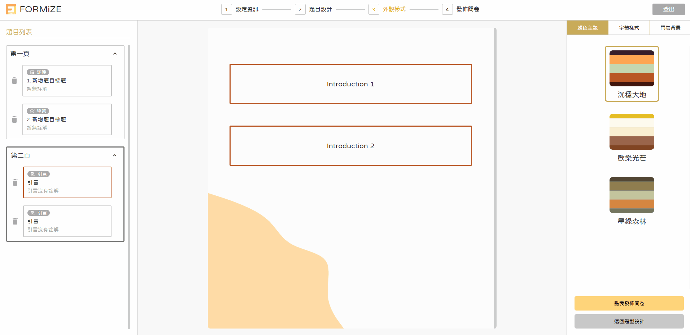
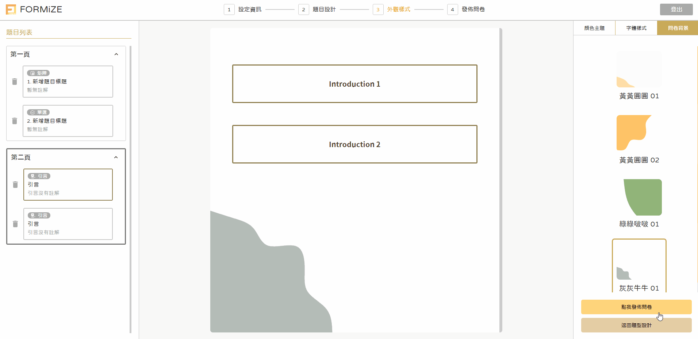
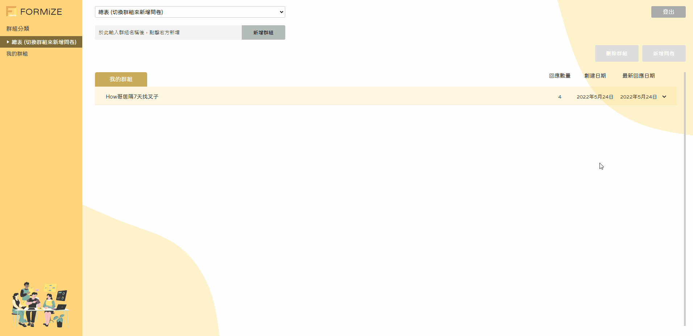
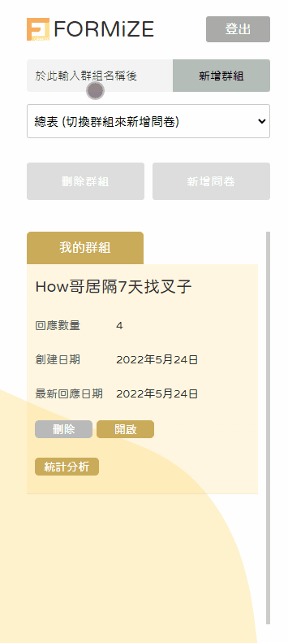
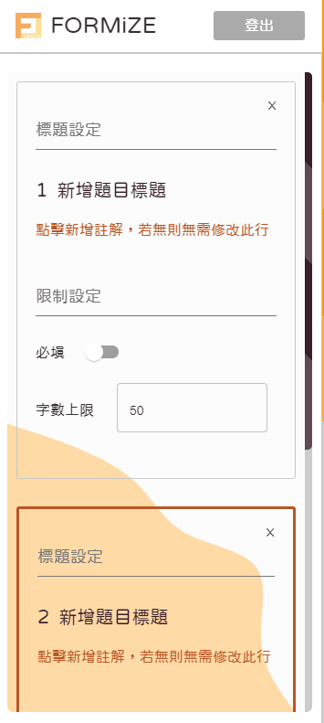

<div >


</div>

> An online form-producing system for members to launch forms after designing the style and content. The platform is equipped backstage to sort forms in groups and also check statistics charts of responses.

## Features

- Forms are categorized in group.
- 10 types of question are available.
- 2 browsing modes are provided to set the pagination.
- Enable a form to have varieties of theme, font, and background.
- Both banners and description in start and end pages can be customized.
- Display responses via 3 kinds of statistics charts.
- Available to mobile (RWD supported, but recommend use on desktop)

## Link

Try out FORMiZE at https://formize.vercel.app/

```
Testing Account: test123@test.com
Testing Password: test123
```

<hr />

## Tech

<table>
  <thead>
    <td>Category</td>
    <td>Name</td>
    <td>Why to Use</td>
  </thead>
  <tr>
    <td>Language</td>
    <td>
      
    </td>
    <td>
      <span
        >Reduced the probability of occurring type errors, and made code more
        maintainable.</span
      >
    </td>
  </tr>
  <tr>
    <td>Framework</td>
    <td>
      
    </td>
    <td>
      <span
        >Extracted heavy counting process to backend, and made page router more intuitive with
        file-based routing.</span
      >
    </td>
  </tr>
  <tr>
    <td>State Mangement</td>
    <td>
      
    </td>
    <td>
      <span>
        Managed complex and frequent updating states of creating questions and collecting answers 
      </span>
    </td>
  </tr>
  <tr>
    <td>CSS-in-JS</td>
    <td>
      
    </td>
    <td>
      <span>
        Made style of components more intutive, and saved the effort to organize class names. Rich resources can be combined with to create outstanding UI.
      </span>
    </td>
  </tr>
  </tr>
  <tr>
    <td>UI Framework</td>
    <td>
      
    </td>
    <td>
      <span>
        Easily customized and intergated its components with React.js and Styled-Components.
      </span>
    </td>
  </tr>
  <tr>
    <td>Backend Service</td>
    <td>
      
    </td>
    <td>
      <span>
        Used as database, authentication, and storage.
      </span>
    </td>
  </tr>
  <tr>
    <td>Unit Testing</td>
    <td>
      
    </td>
    <td>
      <span>
        Intutive syntax and powerful functionality to test logic of utils and helpers.
      </span>
    </td>
  </tr>
</table>
<hr />

#### Other Usage

- @styled-icons
- date-fns
- mathjs
- react-d3-cloud
- react-date-range
- recharts
- sweetalert2

## Flow Chart


## How to Start ?

<div>
  <h3>Start Creating a form</h3>
   
   <h3 >Switch to different steps</h3>
   
   <h3 >Create a question</h3>
   
   <h3 >Delete a question and its content</h3>
   
   <h3 >Switch editing page (only supported in multiple page mode)</h3>
   
   <h3>Switch editing question</h3>
   
   <h3>Style the form</h3>
   
   <h3>Launch the form</h3>
   
   <h3>Check statistics charts of responses</h3>
   
   <h3>Support different devices (RWD)</h3>
   <div align='center'>
    
    
   </div>
</div>

## Contact Me

Feel free to contact me whenever having trouble using FORMiZE!  
Email: liaoweil05621@gmail.com
